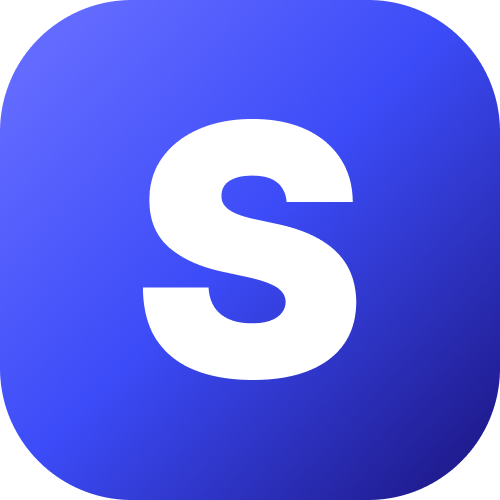

<div align="center">
    
    <h1>Surf Language</h1>
    Surf is a modern and blazing-fast programming language.
</div>

---

## 👋 Welcome

Welcome to the official Surf's standard libraries repository! Here, you will find the source code of the standard libraries that come with the Surf language.

---

## 🎆 Installation

Don't worry! Once you install Surf, the standard libraries will be installed automatically. You don't need to do anything else.

---

## 🚀 Getting Started

To create a new Surf project, you can use the `surf init` command. This will create a new Surf project in the current directory.

> **NOTE:** Make sure the current directory is empty before running the `surf init` command, otherwise, add a name after the command to create a new directory with the project name, e.g. `surf init my_project`.

```shell
surf init
```

You will be prompted to fill relevant information about your project like project name, author, etc.
Once you've filled in the information, the project will be created and you can start coding!

**Example structure:**

```
my_project/
    src/
        main.surf
    Surf.yml
    .gitignore
```

---

## 📚 Documentation

The official Surf documentation can be found on the [official website](https://rodri-r-z.github.io/surf/docs).

---

## 📦 Contributions

Contributions are welcome! If you'd like to contribute to the Surf language, please read the [CONTRIBUTING.md](CONTRIBUTING.md) file for more information.

---

## 📝 License

This project is licensed under the GNU General Public License v3.0. See the [LICENSE](LICENSE) file for more information.

```
Copyright (C) 2024 Rodrigo R. & All Surf Contributors
This program comes with ABSOLUTELY NO WARRANTY; for details type `surf license`.
This is free software, and you are welcome to redistribute it under certain conditions;
type `surf license --full` for details.
```